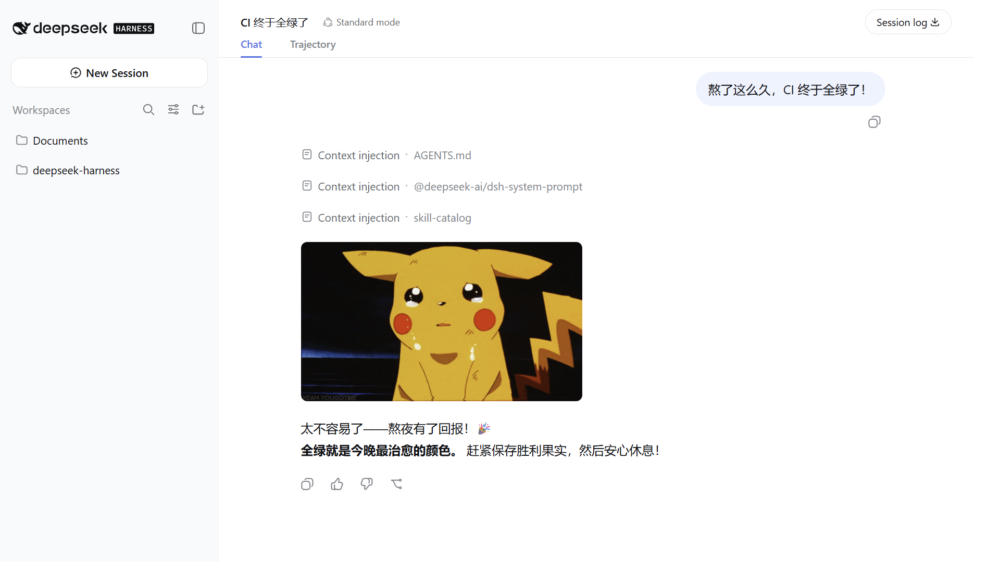

<h1 align="center">dsh-memes</h1>

<p align="center">
  <strong>Natural meme reactions for DeepSeek Harness · 给 DeepSeek Harness 自然发送表情包的能力</strong><br/>
  <a href="#english">English</a> · <a href="#中文">中文</a><br/>
  <a href="https://badgen.net/badge/license/MIT/green"></a>
  <a href="https://badgen.net/badge/tests/47%20passing/green"></a>
</p>



---

<a id="english"></a>

## English

`dsh-memes` gives a DeepSeek Harness agent a `pick_meme` tool backed by the [Agent Meme Stash](https://github.com/kagura-agent/memes), a curated library of more than 260 reaction images across 26 categories. The agent describes the mood or situation, the plugin selects a fitting image by semantic tags, and the Web client displays the GIF directly in the conversation.

The result looks like a reaction message rather than a tool card: successful calls show only the image, without the tool name, matching score, or execution chrome.

### Highlights

- **Natural chat presentation:** the selected GIF appears as a compact reaction image in the assistant flow.
- **Proactive but restrained:** the agent may react at a clear emotional moment without waiting for an explicit meme request, but avoids memes when the conversation is serious or needs a substantive answer.
- **Semantic selection:** aliases, exact categories, and multi-word tag matching handle prompts such as `proud`, `good morning`, or `frieren cringe`.
- **Automatic profile integration:** installation adds the bundle patch to the selected DSH profile; no manual Cordis edit is required.
- **Small package:** meme files are not bundled with the plugin. The package contains only the Host plugin, Web client, and configuration.
- **Resilient remote catalog:** the pinned tag catalog is validated, cached for one hour, shared across concurrent calls, and fetched with a 10-second timeout.

### Install

Install the plugin into the DSH Web profile:

```sh
dsh plugin --profile web add github:kagura-agent/dsh-memes
```

Start or restart the profile, then open a new conversation:

```sh
dsh --profile web
```

The package declares `dsh.bundle.patch`, so DSH automatically adds the plugin and loads its Web client.

### Use

Ask naturally:

```text
Send a celebration meme.
React to that bug with a facepalm.
用一个开心的表情包回复。
```

The agent can call `pick_meme({ mood: "frieren cringe", count: 1 })`. `mood` is required; `count` defaults to 3 and is capped at 10. Image URLs stay in presentation metadata for the Web client; the model receives only a confirmation that the reaction was displayed, preventing it from embedding the same GIF a second time.

Selection resolves common aliases, checks exact categories, requires every query token to match the category or tags, and uses a random fallback when no semantic match exists.

### Configuration

The bundle works without configuration. A mirror or test fixture can override the tag catalog URL in the profile patch:

```yaml
- id: memes
  config:
    tagsUrl: https://example.com/tags.json
```

The image base remains pinned to the Agent Meme Stash revision. A custom catalog must use file keys from that revision.

### Network, privacy, and media

The Host fetches `tags.json` from `raw.githubusercontent.com` on the first call after startup and refreshes it after the one-hour cache expires. The browser loads selected GIFs from `media.githubusercontent.com`, which sends a normal image request to GitHub from the user's browser.

The plugin package contains no meme image files. Images are linked from [kagura-agent/memes](https://github.com/kagura-agent/memes), whose README documents their sources and removal process. The plugin code is MIT-licensed; third-party media remains subject to its respective rights.

### Development

```sh
git clone https://github.com/kagura-agent/dsh-memes.git
cd dsh-memes
npm ci
npm test
dsh plugin --profile web add link:/absolute/path/to/dsh-memes
```

The test suite covers matching, catalog validation, caching, timeouts, DSH Host schemas, Client result normalization, and React rendering. Restart the running DSH profile after changing Host or Client JavaScript.

### Project layout

```text
src/index.js    Host plugin and configuration
src/tool.js     pick_meme definition and result projection
src/match.js    semantic matching
src/network.js  remote catalog validation and cache
src/client.js   natural GIF presentation for the Web client
tests/          Host and Client tests
```

### License

The plugin code is available under the [MIT License](LICENSE).

---

<a id="中文"></a>

## 中文

`dsh-memes` 为 DeepSeek Harness agent 提供 `pick_meme` 工具。它使用 [Agent Meme Stash](https://github.com/kagura-agent/memes) 的 26 个分类、260 多张 reaction 图片；agent 描述当前情绪或场景，插件按语义标签选择合适图片，Web 客户端直接在对话中显示 GIF。

最终效果是一条自然的表情回复，而不是工具执行卡片：调用成功后只显示图片，不展示工具名、匹配数量或执行状态。

### 产品特点

- **自然融入对话：** GIF 作为紧凑的 reaction 图片出现在 assistant 消息流中。
- **主动但克制：** 遇到明确的庆祝、惊讶、鼓励或无语时刻，agent 可以不等用户点名便自然发图；严肃场景或需要完整回答时不会滥用。
- **语义选图：** 支持别名、精确分类和多词标签匹配，例如 `proud`、`good morning`、`frieren cringe`。
- **自动接入 profile：** 安装后自动把 bundle patch 加入指定 DSH profile，无需手动编辑 Cordis 配置。
- **安装包轻量：** 插件不打包表情图片，只包含 Host 插件、Web 客户端和配置。
- **远程目录可靠：** 标签目录固定 revision，经过校验并缓存一小时；并发调用共享请求，单次请求超时为 10 秒。

### 安装

本包声明了 `dsh.bundle.patch` → `cordis.patch.yml`，安装即自动成为 profile 的一个 patch 层，
**无需手动编辑 cordis.patch.yml**：

```sh
dsh plugin --profile web add github:kagura-agent/dsh-memes
```

启动或重启 Web profile，然后新建会话：

```sh
dsh --profile web
```

本包声明了 `dsh.bundle.patch`，DSH 会自动加入插件并加载对应的 Web 客户端。

### 使用

直接用自然语言表达即可：

```text
发一个庆祝成功的表情包。
用一个无语的表情回应这个 bug。
Send a happy reaction meme.
```

agent 可以调用 `pick_meme({ mood: "frieren cringe", count: 1 })`。`mood` 为必填参数；`count` 默认是 3，最多为 10。图片 URL 只通过 presentation metadata 交给 Web 客户端；模型只会收到“图片已显示”的确认，避免再次用 Markdown 嵌入同一张 GIF。

选图依次解析常用别名、匹配精确分类、检查多词标签，并在没有语义命中时随机选择。

### 配置

默认配置即可使用。私有镜像或测试 fixture 可以在 profile patch 中覆盖标签目录地址：

```yaml
- id: memes
  config:
    tagsUrl: https://example.com/tags.json
```

图片根地址仍固定到 Agent Meme Stash 的指定 revision，因此自定义目录必须使用该 revision 中存在的文件 key。

### 网络、隐私与图片来源

Host 在启动后的首次调用中从 `raw.githubusercontent.com` 获取 `tags.json`，缓存一小时后重新获取。浏览器从 `media.githubusercontent.com` 加载选中的 GIF，因此用户浏览器会向 GitHub 发出普通图片请求。

插件安装包不包含表情图片。图片由 [kagura-agent/memes](https://github.com/kagura-agent/memes) 远程提供，其 README 说明了来源与下架方式。插件代码采用 MIT 许可；第三方图片仍受各自权利约束。

### 本地开发

```sh
git clone https://github.com/kagura-agent/dsh-memes.git
cd dsh-memes
npm ci
npm test
dsh plugin --profile web add link:/absolute/path/to/dsh-memes
```

测试覆盖语义匹配、目录校验、缓存、超时、DSH Host schema、Client 结果归一化和 React 渲染。修改 Host 或 Client JavaScript 后，需要重启正在运行的 DSH profile。

### 项目结构

```text
src/index.js    Host 插件与配置
src/tool.js     pick_meme 定义与结果投影
src/match.js    语义匹配
src/network.js  远程目录校验与缓存
src/client.js   Web 客户端中的自然 GIF 展示
tests/          Host 与 Client 测试
```

### License

插件代码采用 [MIT License](LICENSE)。
